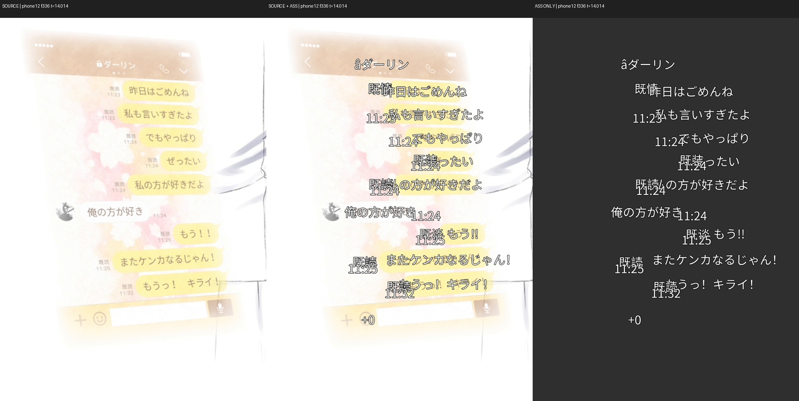
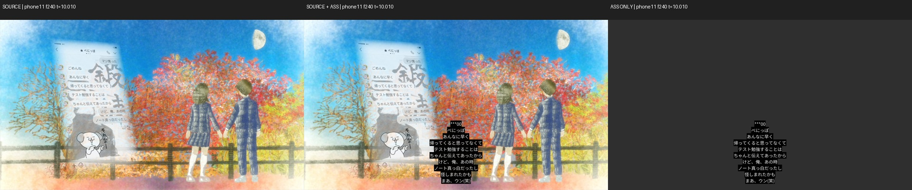
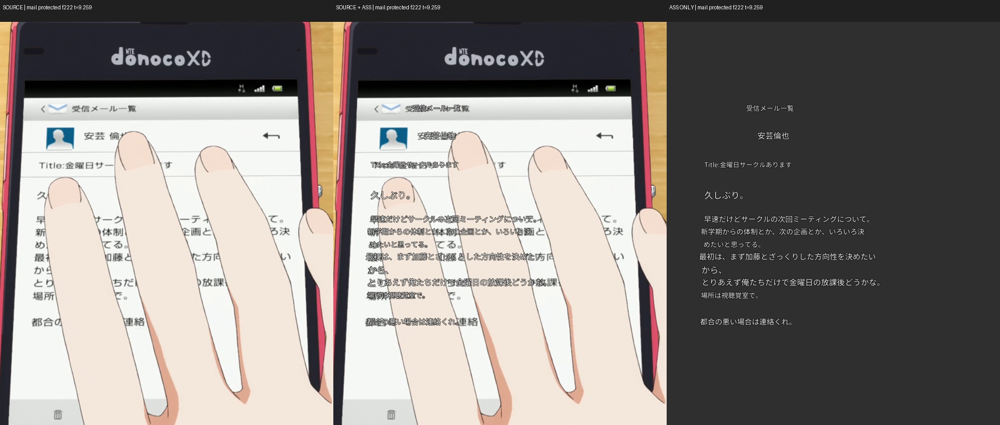
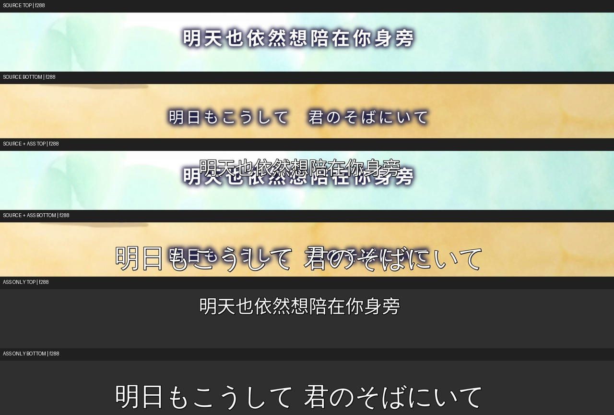
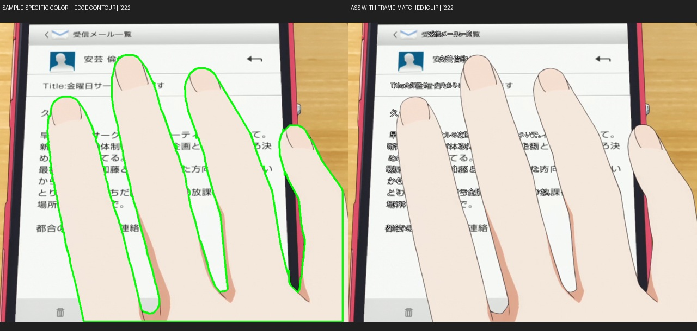

# video_subtitle_ocr 最终优化方案

版本：2026-09-23 最终交接版。唯一配套执行文件：[最终实施计划](FINAL_IMPLEMENTATION_PLAN.md)。

## 0. 接手者先读

这是对可检索到的本项目相关会话和当前任务各轮结论的统一交接，不要求读取聊天历史或旧方案。**已有基础优化已落实；真实视频质量修复仍待实施。** 此文与实施计划是唯一有效的方案/计划，细节修订直接更新这两份文件，禁止再产生并行版本。证据目录是测试资产，不是另一套方案。

源码依据为生产树 `20231ba3f296c1149eddd691f33c962699e68f1d`。`5c832a7a2b53b11dc1b23e6ad4073a35a661ecd0` 只增加真实视频文档/证据，与前者生产代码相同；本次交接整理也只改文档。不要切到旧main、2.5.0或打包目录执行。

### 会话来源与决策归并

| 会话 | 来源ID | 最终纳入内容 |
| --- | --- | --- |
| 分析代码并提出优化方案 | 01a09eb9-b1ed-7330-8cfd-194d8793a188 | 基于2.5.0提出资源预算、指标、恢复、解码、解耦、真实测试；属于历史建议，不等于当前缺陷清单 |
| 分析main分支并制定优化方案 | 01a0a0e0-8c3c-73c3-b07b-56731ab3d1f0 | 源码优先；明确要求矩形/多边形/编辑ROI入口；其他AI交接与基线保护 |
| 设计场景文字显示策略 | 01a0aba7-0960-7a83-a217-6d3a21574a57 | overlap默认、mask、external、whitespace、自动回退；背景取色与亮度、分层、真实渲染验收 |
| 分析并优化项目功能（当前任务） | 01a0cd47-5e50-7cc3-b79b-8ace8c5b9e22 | 已完成基础优化；四视频+邮件对照；零时长、时序摊平、漏遮挡、参数布局；用户最新补充的静字/移动背景与手部轮廓 |

检索范围：应用可见的本项目4项任务；归档任务列表为空。其他项目任务未纳入。历史任务中的287/326/666项通过属于当时版本，不作为本次基线；历史文档不是功能现状证据，保留用户需求后重新用源码核对。旧计划中external按块全程并集的做法被V2替换；不沿用旧设计中的这个错误。

### 最新用户要求（执行时不可丢失）

1. 从源码和真实运行判断合理优化，可精简非必要的重复实现；没有证据不能删除现有用户能力。
2. 先分析真实视频/ASS，再确定方案；实施前有可回退基线。其他AI直接按这两份文件实施，不需要重复探索全部历史。
3. 11号是静止聊天文字叠加横向移动的风景。判断文字自身运动，禁止背景驱动的假move/几何t；亮度t允许保留。
4. 邮件有色遮罩与画面亮度绑定；手部前景轮廓通过iclip裁掉字幕和同处的有色遮罩，保留原视频手部及指缝文字。
5. 保留矩形、多边形与编辑入口，保留场景文字显示策略和静态回退；GUI/CLI有效配置一致。当前仅文档交接，不发布、不改已安装应用。

## 1. 当前状态、架构与保护边界

### 工作目录和资产

| 项目 | 当前机器路径 / 说明 |
| --- | --- |
| 外层工作区 | `/home/hope/Tools/video_subtitle_ocr`，不是Git根 |
| Git源码 | `/home/hope/Tools/video_subtitle_ocr/video_subtitle_ocr` |
| 当前分支 | `optimize/source-analysis-20260923` |
| Python | Git根下 `.venv/bin/python`，Python 3.12.3 |
| 现有视频/ROI | 外层 `test/`，只读；完整路径和SHA见证据source_manifest.json |
| 完整实测原图 | 外层 `test_run/visual_review_20260923/frames/` |
| 可携带证据 | `docs/superpowers/evidence/2026-09-23-real-video/`，已入Git；视频、模型、venv不在Git |
| 构建脚本 | 外层 `build_deb.sh`，本轮不改、不运行打包安装 |

换机器时将这两份文档、Git仓库、证据目录、原视频与ROI一起移交；使用source_manifest.json校验素材，不把未提供素材的机器宣称为真实视频验收通过。运行脚本含本机路径/目录层级，移植时只在新输出副本中改路径并记录，保持帧范围和有效配置。

### 已完成、保留、待实施、暂缓

| 状态 | 内容 |
| --- | --- |
| 已完成，本轮不能重复实现 | CLI共享公共阶段、ROI隔离、线程/缓存清理、阶段进度单调、停止尾部无效解码、ASS原子写、SDK关闭隐式重试 |
| 源码已有，保持兼容并回归 | GUI ROI三种交互；五种策略（含mask_only）、回退链、运动/静态双路径；翻译、字体识别/许可映射等可选模块 |
| 必须实施 | V1–V7及配套A/B/C/D任务；真实渲染验收；配置生效和安全回退 |
| 明确暂缓 | 统一资源预算/全局cache/checkpoint、大规模GUI/流水线拆分、长视频分桶、平面多段重捕获/多锚点识别、CLI精修统一、新模型/云分割、新字体安装和发布 |

GUI ROI入口现状由 `components/control_panel.py::set_quick_mode` 的 `draw_mode_group.setVisible(True)` 及 `main_window/roi_editing.py` 核对。场景策略现状由 `core/scene_text_policy.py::POLICY_MODES` / `PolicyResult` 核对。历史参考帧、非法框防护、重复行line_idx和诊断已有实现，本轮是回归它们，不重新写一套。

### 数据流与入口

```text
GUI main_window → PipelineWorker ┐
CLI cli.run_pipeline            ├→ PipelineContext → extract_and_ocr_stage
                                └→ restore_stage（GUI另有boundary refine）
ROI有效配置 → collect_motion_roi_specs → scripts.motion_ass.build_motion_events
  → 平面跟踪 → 行文字/位姿校验 → 时间切分 → 策略/遮挡/亮度 → 候选ASS事件
恢复后的静态OCR + 轨迹候选/证据 → OCRToASSOptimizer → 接管判定/策略/样式
  → 翻译/字体等可选阶段 → ASS原子写出
```

上图策略/遮挡的具体顺序需要B2/B4收敛：几何切分先于相对时间动画；手部裁剪必须作用于最终仍在物体上的文字和有色mask。external/whitespace移动后移除原处clip；亮度最后按绝对时刻生成。不要把“当前调用顺序”当作不可调整的产品约束。

### 保留的功能图谱

| 能力 | 实际代码入口 | 判断 |
| --- | --- | --- |
| GUI 加载/播放、矩形/多边形 ROI、颜色过滤、配置保存 | main_window/*、components/* | 主交互，保留 |
| CLI 视频/ROI 文件、引擎/语言/模型选择 | cli.py | 自动化主入口，保留并消除重复主流程 |
| 全帧扫描、字幕条带/水印/场景文本识别 | fullframe_scanner、subtitle_roi_suggester、video_type_detector | 减少手工标注，保留 |
| 抽帧、相似帧跳过、投票、边界精修、坐标还原 | roi_extractor、ocr_optimizer、pipeline_stages | 核心，优先优化 |
| 长视频进程分块、失败重试、顺序回退 | chunk_planner/worker/parallel_runner/merger | 有实际用途，保留 |
| 运动平面、轨迹、亮度、遮挡、场景文字布局 | scene_plane_tracker、motion_ass、scene_text_policy | 与静态字幕不同的处理能力，保留 |
| ASS 合并、样式、噪声过滤、可选润色 | subtitle_generator/*、subtitle_llm_polish | 输出核心，保留 |
| 可选翻译及字体识别/映射/许可数据库 | font_intel/*、font_cli.py | 独立可选能力，不能仅凭体积判为无用 |
| CPU/GPU 依赖与 DEB 打包 | requirements*.txt、外层 build_deb.sh | 本轮不改安装策略，不自动安装/发布 |
### 基线与恢复（已存在 vs 待创建）

- 原始基线 `ead48f9c3381291bedce2199bab585d53461b4c0`，标签 `baseline/source-optimization-20260923` 已存在。
- 独立备份 `/home/hope/Tools/video_subtitle_ocr_backups/20260923-source-optimization/` 已存在：repository.bundle、source.tar、SHA256SUMS及原/优化测试证据。
- 本次合并前保留点 `baseline/final-plan-consolidation-20260923` **已创建并指向5c832a7**；独立备份 `/home/hope/Tools/video_subtitle_ocr_backups/20260923-final-plan-consolidation/` 的repository.bundle、docs-before-consolidation.tar和SHA256SUMS已校验。旧方案可由Git/备份恢复，不再留作活动入口。
- `baseline/real-video-optimization-20260923` **尚未创建**，必须由接手者在首次代码修改前按实施计划创建并验证；不能把计划步骤当成已经执行。
- 备份不含虚拟环境、模型缓存、忽略的运行目录及原视频；同机备份用于误改恢复，不等于异地灾备。

源码恢复使用另建worktree或新目录clone；单任务撤销使用git revert。不能用reset --hard、clean或覆盖他人的未提交修改。

### 已完成改动与验证（历史事实）

2026-09-23 已完成本设计范围，按独立提交交付：

| 提交 | 结果 |
| --- | --- |
| deba293 | CLI 复用公共阶段，ROI 隔离，缓存和生成器清理，流式进度单调，流式退出等待任务 |
| 7c39a78 | 普通/合成抽帧在最后活动 ROI 帧后停止解码 |
| 9cb3c7b | 三个 ASS 写入分支使用原子替换，失败保留旧文件 |
| 1249459 | SDK max_retries=0，外层统一控制 429 重试 |
| afaac2e | 非流式并行 ROI 失败时停止其他任务，再退出线程池 |

新增回归先在原实现复现问题：阶段生命周期/CLI 5 个失败；尾部解码 4 个失败；原子输出 5 个失败；SDK 重试用例 1 个失败。修复后对应测试全部通过。测试使用 mock HTTP，不调用真实收费 API。

真实 RapidOCR 小视频：1280×720、30 FPS、480 帧，单 ROI、workers=1。原版与优化版均成功输出 5 条 Dialogue，ASS 逐字节相同，SHA256 为 `db9f9d2e28fe2de1126812ce450e87fa77badb6617f38dd48a60c38e4fdd341f`。两次墙钟耗时分别 83.11/111.76 秒，峰值 RSS 1930768/2000444 KiB；优化版与全量回归并发运行，资源竞争不同，因此这些值仅为运行记录，不作为提速或内存优化证据。

解码专项：同一真实 480 帧视频只提取 0..29 帧。两版帧号和像素哈希完全一致；3 次测量原版约 0.070–0.086 秒，优化版约 0.016–0.017 秒。另有计数型回归保证 ROI 结束后不再 grab，收益仅针对存在不需要处理的尾部，不外推为整体 OCR 的固定提速倍数。

首次完整优化回归：1594 passed, 1 skipped, 14 warnings。最终代码全量验证：1595 passed, 1 skipped, 14 warnings，72.25 秒；F 类静态检查与 git diff --check 通过。新增 23 项测试。

证据目录为上述20260923-source-optimization独立备份目录，新增 `task1-red.log`、`task2-red.log`、`task3-red.log`、`task4-red.log`、`optimized-tests.*`、`final-tests.*`、`original-cli.log`、`optimized-cli.log`、`cli-comparison.json`、`decode-comparison.json`、`original.ass` 和 `optimized.ass`。

## 2. 实验方法与证据

完整运行目录：`/home/hope/Tools/video_subtitle_ocr/test_run/visual_review_20260923/`。仓库内保存可审阅的 ASS、日志、诊断数据和精选图片：[证据索引](superpowers/evidence/2026-09-23-real-video/README.md)。原始全分辨率 PNG 保留在运行目录 `frames/`；没有复制原视频进 Git。

CLI 使用 Paddle、`--model-tier small --workers 1`，CPU 绑核 0–7、OMP 线程 8；phone11 明确传 `--lang japan`，其余 `ch`。关闭本次 VLM 润色地址/密钥，使用缓存 OCR 模型；没有调用翻译、字体识别或收费 API。邮件对照增加 `--auto-brightness --occlusion-clip`，绑核 8–15。命令/环境/提交及 ROI 哈希见 `all_runs.json`；四次主运行的原始记录见 `runs.json`。对照命令由已完成会话和日志重建，已单独标注。

FFmpeg 6.1.1/libass 0.17.1 渲染：先在原始时间轴上应用 ASS，再用 `select=eq(n,帧号)` 截帧；不先 seek 后把时间重置为 0。另在同尺寸、同 FPS 灰底上渲染纯 ASS，以区分原始硬字幕和生成字幕。帧号从 0 开始，FPS 均为 24000/1001。三联图依次为原画面、原画面+ASS、纯 ASS；手机局部裁图之外另保留完整画面，避免把画外旁注误判为消失。

| 样本 | 分辨率 / 帧数 | 已保存 ROI | ASS Dialogue | 零时长 | 墙钟 / 峰值 RSS KiB |
| --- | --- | --- | ---: | ---: | --- |
| mail：邮件手机 | 1920×1080 / 246 | 0–245，pose 开，亮度/遮挡关，overlap | 24 | 0 | 36.98s / 1,934,908 |
| phone11：静止聊天/移动背景 | 1920×1080 / 652 | 0–650，pose/亮度/遮挡开，mask | 1 | 0 | 105.42s / 4,526,740 |
| phone12：聊天切换 | 1920×1080 / 2247 | 0–1870，pose/亮度/遮挡关，overlap | 1441 | 1138 | 59.79s / 4,373,624 |
| opening4k：双语歌词 | 3840×2160 / 2210 | 上下两条矩形 0–2209，pose/亮度开，overlap | 20 | 0 | 211.20s / 5,454,108 |
| mail_protected：邮件对照 | 同 mail | 同原 ROI，CLI 开亮度和遮挡 | 24 | 0 | 43.24s / 1,936,648 |

所有输出无负时长。上述耗时包含模型初始化且资源条件不同，不能作为提速比例。未覆盖现有 NCED、真人素材、GPU、GUI 手工流程、长视频分块或安装包。

## 3. 分镜发现、证据和根因

### V1 / P0：同屏不同行被当作顺序字幕截短

phone12 有 1138/1441 条 Dialogue 的开始与结束完全相同（约 79%），第一批位于 10.96 秒。14.014 秒 f336 和 39.998 秒 f959 可见聊天正文、时间、已读标签同时存在，ASS 元信息与正文挤在一起。

根因已用两条合成输入复现：同 ROI、Scene 样式，位置分别 `(100,100)`、`(100,200)`，均为 `[1.00,1.12)`；`core/subtitle_generator/event_merge.py::_clamp_same_roi_event_overlaps` 将第一条改为 `[1.00,1.00)`。它仅比较 ROI/style，未区分同时共存的文字行。证据 `zero_duration_repro.json`。

设计：Scene 不参与这种无行身份依据的端点齐平；非 Scene 仅在下一条开始严格晚于前条开始且确属同一显示通道时裁剪。策略遮罩继续保持既有豁免。ASS 量化后必须 `end > start`，但不能以批量删除零事件作为修复。添加共存行、同通道切换、近重复合并及输出正时长回归。



边界说明：phone12 配置只覆盖约 78 秒；其后没有字幕不能作为漏检证据。4.5 秒中央标题不在 ROI 内，也不算漏检。keep_all 要求保留时间/已读等文字，这些不是应被一刀切删除的噪声；`â`、`+0` 等局部误识别单独记录，不能用放宽清洗来掩盖布局问题。

### V2 / P0：聊天内容失去时间关系

phone11 整段仅一条 NoteBox，`[0.00,27.15)`，包含固定十行；1 秒、10 秒、22 秒画面实际文字不同。10 秒原画面包含 `ごめんね`，输出缺失；22 秒画面包含 `お父さんには言わないでおくって`、`もう、家に入れてくれない?`，输出也未包含。输出中的后期文本在开头已可见。全帧图显示黑底十行旁注占据画面下方，不是裁到视频外。



日志显示 651/651 轨迹帧有效，代表帧集中于 370/381/389，融合词表只有十行；mask 因背景变化回退 external。两个独立问题叠加：

1. `scripts/motion_ass.py` 的参考帧融合并未覆盖后来出现的全部文字；`trajectory_takeover_ok` 仅按时间覆盖率放行，100% 跟踪不代表100%内容召回。
2. `core/scene_text_policy.py::_apply_external` 将块内时间取 min/max，再拼全部正文；静态 `generator.py::_finish_scene_policy_events` 对 note/scene_ws 也取全 ROI 的并集。即使上游行时序正确，策略层仍可抹平。

设计：策略层按输入行开始/结束边界扫描，每个半开区间只布局该时刻有效的行，保持稳定行序和重复文字不同实例，空区间不输出，只有相邻且活跃行身份与布局完全一致才合并。静态 mask/whitespace 同样按活动集合生成，遮罩不得跨越没有文字的间隙。

按用户补充，phone11 是静止的聊天文字叠在从右向左移动的风景上；不同时间出现/切换的文字不能据此统称为“滚动文字”。背景运动不能充当文字运动证据，见 V6。

轨迹接管在策略合并前，将轨迹行与静态 OCR 的分时段文本证据对照：缺字或出现超前文本即拒绝该 ROI 的整段接管，保留静态结果并经过上述时间安全策略。先采用整 ROI 的保守回退，减少新边界和动画裁切风险。静态没有可靠证据时明确记录“无法验证”，保留已知静态结果；不是擅自延长轨迹文字。分段混合接管和多锚点重识别不列为本轮必须实现的扩展。

### V3 / P0：遮挡被第二次采样漏掉

mail 基础输出在 `[0,3.54)`、`[6.54,10.26)` 各 12 行；中间切到人物时没有持续覆盖，这是应保留的行为。9.009 秒 f216 画面变暗且手指盖住屏幕，基础配置关闭亮度/遮挡，因此此时叠字本身不能证明开关失效。

开启两开关后，亮度确实变暗，但依然 24 事件、零 `\iclip`；手指上仍有新增文字。诊断捕获检测帧 `[207,210,213,222,225,228,231,234,237]`。后半段各事件都有九个检测帧落在跨度内，却全部 `chosen_hits=[]`。f222 也已截图，避免只检查未命中检测的 f216。



`core/occlusion_mask.py::attach_occlusion_clips` 从所有轨迹帧均匀挑七帧，再精确查检测字典；这组采样与检测采样不相交。`build_clip_tag` 还把首末命中蒙版动画铺到整个事件，而没有使用真实命中时间；此为源码确认的时间风险，尚未由本次输出复现（本次根本没有生成 clip）。现有 vector iclip 动画是否被 libass 支持必须通过像素实验验证，不能靠字符串断言。

设计：保留检测采样时间线，空数组表示已确认无遮挡，失败/未采样不得伪装成无遮挡；从实际检测样本取值，不再从完整轨迹另抽七帧。使用离散时间片静态 vector iclip，避免依赖未经验证的 vector clip 插值。仅在采样支撑的小区间应用蒙版，清晰帧不受影响；从原始轨迹按绝对时间重建运动、亮度/渐变，禁止只复制动画标签再改事件起点。上游模型若误把文字变化当遮挡仍可能误裁，这是下一步实测要独立观察的风险。

### V4 / P1：模型、策略、语言和姿态没有统一生效

源码与日志共同确认：CLI 请求 small，运动阶段仍加载 `PP-OCRv6_medium_det/rec`；`_run_motion_quad` 未继承全局 `_engine_options_from_args`，只在单 ROI 有语言时传一个语言字典。

其他源码确认项：`load_roi_file` 丢失配置顶层 `ocr_lang`；显式 scene policy 在运动执行后才用于静态阶段；默认 overlap 与显式 overlap 无法区分，不能覆盖已保存 mask；GUI 收集 `roi_pose_tags` 并传给转换器，而 CLI 未传。本次 phone11 已显式传 japan，因此不能把观察到的所有漏字归因于顶层语言丢失。

设计：启动前统一解析配置，静态/运动共用有效结果。模型及 scene policy 显式 CLI 参数优先于配置；语言保留“ROI 语言 > 显式全局 --lang > 文件顶层语言 > ch”，以兼容同片多语种 ROI；未传参数用 None 区分，而对外无配置时行为保持原默认。保留 `load_roi_file(path)->list` 兼容接口，新增完整配置读取接口。CLI/GUI 共用姿态收集。日志显示有效引擎、模型、语言、策略与回退原因，不输出密钥。

### V5 / P1：尺寸与位置偏差，字体环境需单独控制

opening4k 20 条事件，12.012 秒 f288、20.020 秒 f480、39.998 秒 f959 的两种语言正文基本对应；未人工逐帧标注全片，不能宣称零漏字。底部运动识别在十二个候选参考帧均失败，顶部仅覆盖约15%，最终回退静态，保住后续歌词。



ASS 使用 Top 108、JP 130 的全局字号和边距，没有位置标签；上方文字偏高，下方文字明显过大。ROI 中已保存 pose=true，CLI 缺失传递是位置问题的一部分；保存的 ROI 中心并不严格等于字形中心，单纯补传 pose 不等于像素还原。phone12 的小标签被统一 Scene 字号放大也是几何问题。

本机 `源ノ角ゴシック JP` 没有命中所指字体。libass 日志显示先 DejaVu Sans，再回退 WenQuanYi Zen Hei；中文命中 Source Han Sans CN。详见 `font_render.log`。字体笔画差异不能全部归责算法，不在本轮自动安装字体。

设计：先修配置传递，再让 Scene 的基础字号受 OCR 行框高度/宽度约束，保留小字与正文的层级；还原旋转和颜色继续由 pose 选项控制。有 pose 的上下字幕带保留行框几何以推导字号，并尊重保存的位置；无 pose 的传统字幕继续使用模板/默认排版。尊重用户自定义模板，不强行以 OCR 覆盖字号。采用当前可用字体实测文字边界，记录字体替代；验收分“保存的姿态正确生效”和“与源文字几何相符”，不将两者混为同一指标。

### V6 / P0：静止文字与移动背景必须解耦（用户补充）

11号视频的聊天文字应在各自可见片段内保持屏幕位置，风景从右向左移动。`core/pose_verify.py::_match_center` 当前使用包含背景的灰度模板、围绕平面预测位置搜索；透明气泡中的背景纹理可能主导模板峰值。已有校正不是没有这一能力，而是本次仍未可靠成功：日志为 `0 static, 10 corrected`，四行回退到轨迹，其中一行记录 `run drift 8.5px > hold_tol 2.5px`。这支持背景污染风险，但不是每个中间运动标签都已人工逐帧定罪。

**本轮最终 phone11.ass 不含 `\move`**：external 回退把它改成固定旁注。其现有 `\t` 全部是亮度颜色/alpha变化，不能当成错误几何动画。后续需保存 policy 前事件来定位这一隐藏问题；不以删掉所有 `\t` 为修复。

设计：在同一文字实例的可见区间内，以 OCR 字形/笔画区域作为匹配权重，排除气泡外和透明背景；同时围绕上次可信文字位置、固定屏幕锚点和平面预测候选搜索，不能只有随背景漂移的候选。屏幕内文字证据不足则进入未知/静态回退，不能用背景单应补成文字运动。稳定片段输出 `\pos`；只有文字自身的可信中心/角度/尺度持续变化才输出 `\move` 或几何 `\t`。亮度/透明度 `\t` 独立保留。真正移动的手机或滚动正文仍可跟踪，不把所有画面强制静止。

### V7 / P1：有色遮罩随亮度，手部轮廓负责几何裁剪（用户补充）

需区分两种蒙版：

- 遮盖原字的 `\p1` 有色图形是可见图层，必须与所在屏幕的明暗同步；保持不透明，用背景基色×有效亮度比改变颜色，不能靠降低alpha露出原字幕。字幕文字和有色遮罩使用同一绝对时间/有效亮度源，手部前景像素不得污染亮度测量。
- `\iclip` 是不可见的反向裁剪边界，没有自身“亮度”。它应跟随手的几何边缘，同时裁掉文字和位于同一物体上的有色遮罩，保留原视频的手；不能只裁文字而让背景补丁盖住手。屏幕变暗不应使手部轮廓失效。

源码已有一部分设计：motion策略保留 `base_color`，`scripts/motion_ass.py` 用 `brightness_tag_chain(..., base_color=..., use_alpha=False)` 给遮罩变色。本次邮件为overlap，没有有色mask，因此还没有真实验证该路径。静态 `_static_mask_spec` 虽携带base_color，但生成器构造事件时未保留它，也没有对应亮度配置，需补齐。不能将已有运动遮罩能力误记为完全不存在。

视觉轮廓试验：把用户给的路径直接套在 f216/f222/f228，libass正确执行 `\iclip`，但路径与这些帧的手势有偏移，不能直接全段复用。以该路径为种子的宽松GrabCut也会误吞手机背景，保留为失败案例。随后采用**仅针对此素材**的颜色前景种子、局部边缘优化和逐帧轮廓，在三个帧上生成与手更贴合的路径；纯画面对照可见手指上的新增字幕被裁掉、指缝文字保留。证据是几何方法可行，不是通用手部分割或全片追踪已完成；少量边缘过裁仍需量化。



生产方案：从亮度归一后的变化区域及可靠前景种子产生候选二值蒙版，在局部ROI内用颜色/边缘联合分割（OpenCV已可用），保留指缝和多个不连通区域；轮廓简化后输出1920×1080屏幕坐标的vector iclip，其他PlayRes按明确坐标变换映射。轮廓按采样帧更新，出现/离开、快速形变和低置信度时加密到逐帧；不用背景单应去拖动独立运动的手。分割失败标记未知并回退已有可信证据，不将整屏当手、也不继续沿用过期轮廓。本轮不新增云视觉调用、分割模型下载或描边编辑UI；用户路径保留为校准/回归参考，不硬编码为生产答案。
## 4. 最终决策与验收矩阵

采用现有架构内分层修复：时序正确→配置贯通→遮挡与亮度→文字运动证据→布局→全量实测。删除错误的全段并集、漏掉检测的二次采样、重复参数拼装；保留可用的静态回退、运动文字与可选字体/翻译。不采用“关闭整个功能换取测试通过”或一揽子重写。

| 需求 | 实施任务 | 必须观察到的结果 |
| --- | --- | --- |
| V1 多行时序 | A1 | phone12非正时长为0；合法共存行仍在，不能靠删除1138条达标 |
| V2 时间/内容保真 | A2/A3 | 半开区间只含活动行；拒绝接管时移除对应候选轨迹并保留静态；无未来文字 |
| V3 有效遮挡 | B1/B2 | 检测样本进入真实裁剪，f168清晰、f222遮挡、切镜空白均正确 |
| V4 配置 | C1 | small在两路径真正生效；ROI语言、显式overlap和保存pose被尊重 |
| V5 几何/字体 | C2 | 小字不被放成正文大小，4K保留上下十组主体歌词；字体替代单独说明 |
| V6 背景运动 | D1 | 静字无move/几何t，真实移动文字可跟踪；亮度t不误删 |
| V7 mask亮度/轮廓 | B3/B4 | 有色mask随明暗不露底；文字+mask同受手部iclip裁剪；指缝保留 |
| 历史功能保护 | G0/G1 | ROI绘制/编辑、五种策略、mask_only Comment、回退、可选翻译字体不退化 |

全量单测通过不是视觉验收替代。已有基线为1595 passed、1 skipped、14 warnings；后续新增测试数量可变化，必须记录实际结果。真实运行保持相同请求参数；C1修复后实际medium→small的变化属于预期配置修复，不能用旧版混用medium的结果宣称纯性能提升。

### 不可误解的边界

- overlap本来就会叠加源硬字幕；不能把重影一概当定位错误。ASS不是视频修复器，纯色mask不具备模糊填充/背景重建能力。
- phone12 ROI到约78秒；ROI外标题、末段无字幕不算此ROI漏识别；keep_all下已读/时间小字需保留。
- phone11最终基准只有固定NoteBox，现有t为亮度；背景污染须检查策略前轨迹和稳定文字片段。
- 固定手绘轮廓与样本肤色阈值不是通用分割；三帧试验不代表全片可用。不同坐标系不可混用，pixel→PlayRes仅变换一次。
- 人工只抽查部分帧，没有全片字符/像素真值；不虚构CER、IoU或加速比例。GPU、长视频分块、完整GUI、其他素材和打包未做本轮实测。
- 新实现可以用更简单的等价内部函数，但必须保留本文行为、回归和证据；对契约调整先在这两份文件记录原因，不能悄悄变更验收口径。

## 5. 后续方向与旧资料处置

历史2.5.0的ExecutionPolicy/RuntimeBudget、PipelineMetrics、VideoFrameSource、checkpoint、缓存合并和大文件解耦保留为后续候选，**不并入本轮交付**。没有真实准确率和资源对照前，不改投票窗口/分片默认值。平面重捕获、多锚点和分段混合接管同样暂缓。字体字号校准仅做C2必要几何约束，字体识别/许可/翻译保持已有接口和可选语义。

所有旧方案/实施计划从工作树移除，历史内容在合并前标签与独立备份中；README、CHANGELOG、打包/测试说明、提示词和历史验收证据保留，它们不是本次执行入口。被替代文件的名单在配套计划中记录。不要读取旧文档推翻最新用户纠正，也不要因为旧计划有未勾选项而自动扩大本轮范围。

## 6. 交接完成的定义

接手AI只需这份方案、最终实施计划、当前源码与证据素材。先按G0建立新基线，按任务完成红绿回归/独立提交，再按G1复跑视频和渲染；全部硬验收通过后才勾选整体完成。不能把图片原型/已经完成的基础优化重新申报为本轮代码成果。
